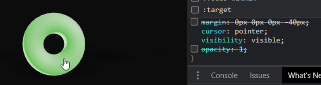
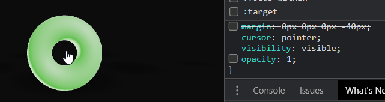
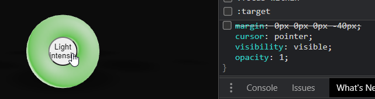
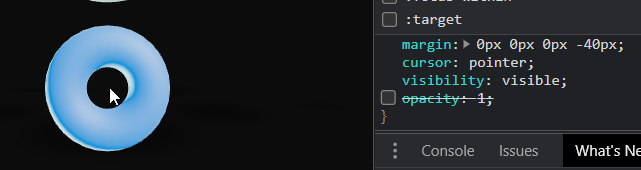

### Position of the accessible dom causing wrong hover detection

In the demo, you may have noticed in App.js that the component ToggleButton is wrapped in an A11y component that use the prop `a11yElStyle` like so

```jsx
<A11y
  role="togglebutton"
  description="Light intensity"
  actionCall={() => (state.dark = !snap.dark)}
  activationMsg="Lower light disabled"
  deactivationMsg="Lower light enabled"
  a11yElStyle={{ marginLeft: '-40px' }}
>
  <ToggleButton position={[0, -3, 9]} />
</A11y>
```

Why is that ?

In order to make this "donut" accessible as a button react-three-a11y will keep an html button over it.

If we inspect the DOM, you should see something roughly like this for the above example.

```html
<button aria-pressed="false">Light intensity</button>
```

By default this button is positioned in the center of your 3D object which would cause it to work like this.

1- Mouse is not over

<p align="middle">
  
</p>

2- Mouse is over the donut, color change is triggered and the cursor pointer is displayed

<p align="middle">
  
</p>

3- Mouse is not over the donut, but the color change is still triggered as is the cursor pointer

<p align="middle">
  
</p>

If we display the button we can see that it's caused by the button being positioned in the middle of the donut

<p align="middle">
  
</p>

4- If we add `a11yElStyle={{ marginLeft: '-40px' }}` to the A11y component, the button is moved to the left and not in the center of the donut anymore

<p align="middle">
  
</p>

5- And as we can see, it fixes our issue. The cursor is default and no color change while the cursor is in the hole of the donut.

<p align="middle">
  
</p>
